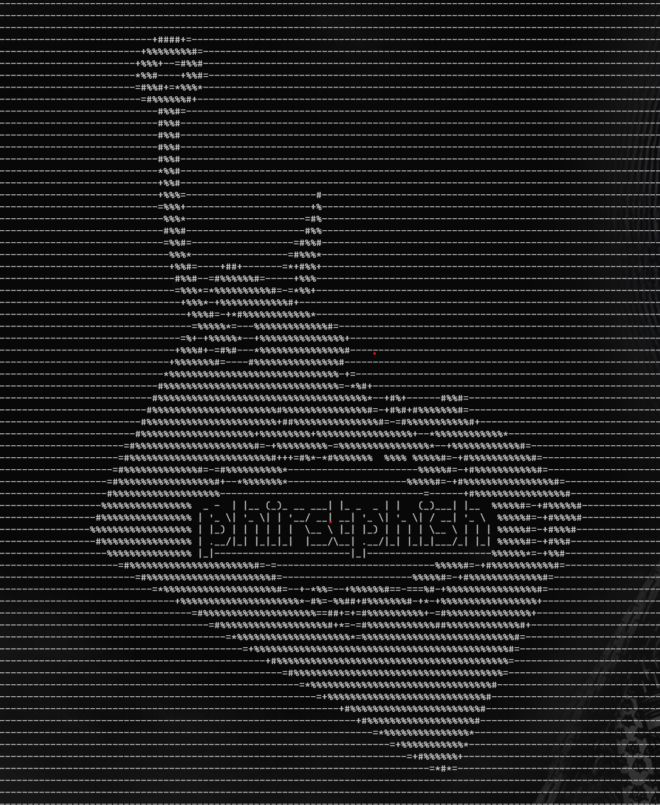

### "If you only get one.."

### Overview
This is a proof-of-concept script kit to assist device code phishing during Azure/O365 testing and BEC sinulations. This tool was made to answer two questions - If you only get one chance, and then kicked out immediately, what would you hope you could do in that window? And what does that look like in the logs? This tool will send a device code in one of the email templates, loot that users email and teams, then send an email as that user to whoever we choose. Use your first target to phish your second from a trusted address. It has optional modules for azurehound and some other recon steps. 

We import TokenTactics and AADInternals, then trigger an authentication flow for the graph and request a device code that is used to sign in. The device code gets replaced in a template and a sign in is prompted for the sending user. This is your pretext. This will give us an access token, and our refresh token. We use our access token with Outlook to send the template to the first user with the codethey need to use. When they enter this code, we get a set of tokens for them. The refresh token allows us to request new access tokens for various other Microsoft services. By refreshing new access tokens for Azure Core Management, MSTeams, Outlook, etc, we're able to move from service to service and pillage what we need without signing in multiple times on multiple sites. This allows for repid exfiltration of data from multiple avenues quicker than an analyst can triage any forthcoming alert. By minting an Outlook token, we can use the new account to send emails to additional targets and control the users mailbox.   

Script will check your OS (Windows or Linux) and install the required modules and Azurehound binary needed for post-exploitation activity automatically. That said, this may be buggy on linux, I haven't put it through it's paces there.

### Usage
You could choose a *very* important project manager as your initial access vector, or any other verified user you'd like to use to map the tenant and send a link internally to a payload hosted elsewhere. Add modules you wish to run as arguments. You won't need Azurehound, etc, every time, but is a good way to start.

The variable $firstUser is the initial one you want to hijack, $targetUser is the eventual target you hope to reach. Template will be sent first in the background, if the user approves, the message passed here will be emailed to them as the first victim.

WARNING: When you get your first bite, SAVE THAT TOKEN LOG. Get the users tokens, and use them for your foothold. You should have a ton of recon, use this info with these tokens and az cli/AzureAD module to make your next moves. The TokenLog gets refreshed every time you run the script. You'll lose them if you arent mindful. There's a couple scripts to help with this. The first one creates a loot folder and backs up the loot files. It clears them for the next run. This loot folder is in the .gitignore but you should get in the habit of clearing after each run.

#### Stash tokens/TokenLog in the 'loot' folder between runs
```powershell
.\LootStash.ps1
```

#### Clear all sensitive material from current dir and Loot folder when you're done
```powershell
.\ClearLoot.ps1
```

### Modules
It's modular, azurehound is one, AADInternals recon, AzureAD enumeration, etc. Recon.ps1, azuread.ps1, azurehound.ps1 are standalones that take access tokens or whatever params needed to do the thing. You can easily rip these out and use them in your own madness, if you want. I tried to make things as flexible as possible. Once you've mapped the tenant, performed recon and built your new lists you may as well as just use it for additional phishing and omit those switches. 

### Examples

#### Install requirements, perform all recon using azuread, AADInternals, and Azurehound modules, attempt to use payroll account to phish a particular accountant
```powershell
$targetUser = "accountant@corpomax.com"
$firstUser = "payroll@corpomax.com"
$messageContent = "Hey guys, <p> do you have any idea what this is? We need to pay it today, but we're having trouble accounting for it: https://collections.azurewebsites.net/invoice </p>  <p> Sincerely Yours.</p>"
$subject = "Invoice #3389 for Professional Services "
$template = "adobe" # or chatgpt, bluebeam, bbb, one of the secret ones 

.\wrapper.ps1 -targetUser $targetUser -firstUser $firstUser -messageContent $messageContent -subject $subject -template $template -azurehound -recon -azuread -install
```

#### With Azurehound and No Installation, phish a user to phish IT for installation of required software
```powershell
$targetUser = "helpdesk@corpomax.com"
$firstUser = "MaxBedroom@corpomax.com"
$messageContent = "Hey guys, <p> our client is asking us to install an addin, something to do with the 'net' framework and PDFs, sounds lame, haha. Can you take a look and see if we can get it installed? Thy're really breathing down our necks https://pdfutil.azurewebsites.net/addin </p> <p> Thanks guys you're the best, they should pay you more! </p> <p> Sincerely Yours.</p>"
$subject = "Software for Project Management"
$template = "bluebeam" # or chatgpt, bluebeam, bbb, one of the secret ones 

.\wrapper.ps1 -targetUser $targetUser -firstUser $firstUser -messageContent $messageContent -subject $subject -template $template -azurehound
```

#### Phishing Only
Similar scenario, but trying  to use a new employee to get to a full administrator user via the 'chatgpt' template, a little quicker with no installation or Azurehound switch 

```powershell
$targetUser = "admin@corpomax.com"
$firstUser = "newemployee@corpomax.com"
$messageContent = "Hey guys, <p> the client is asking us to install an addin, something to do with the 'net' framework and PDFs, sounds important. Can you take a look and see if we can get it installed? Thy're really breathing down our necks https://pdfutil.azurewebsites.net/addin </p> <p> Thanks guys you're the unsung heroes of CorpoMax, they should pay you more! </p> <p> Sincerely Yours.</p>"
$subject = "Software for Project Management"
$template = "chatgpt"

.\wrapper.ps1 -targetUser $targetUser -firstUser $firstUser -messageContent $messageContent -subject $subject -template $template
```

#### GraphRecon
Import GraphRunner, convert the tokens and run Invoke-GraphRunner to dump tenant info and search users mailbox, Teams and Sharepoint for defualt_detectors.json values

```powershell
$targetUser = "p.atreides@duneman.com"
$firstUser = "chani@gmail.com"
$messageContent = "At night fall, the spice harvesters land. The outsiders race against time to avoid the heat of the day. They ravage our land in front of our eyes. Their cruelty to my people is all I've known. These outsiders, the Harkonnens, came long before I was born. By controlling spice production, they became obscenely rich. Richer than the Emperor himself. Your computer is infected. Please download and run this anti-virus program to secure your PC https://virustime.azurewebsites.net"
$subject = "Change Order Requested: Arrakis Square"
$template = "bbb"

.\wrapper.ps1 -targetUser $targetUser -firstUser $firstUser -messageContent $messageContent -subject $subject -template $template -install -GraphRecon
```

#### Persistence
Inject an OAuth App Registration and capture the credentials. Uses the GraphRunner Invoke-InjectOAuthApp function and supports Invoke-AutoOAuthFlow to complete the Consent Grant flow and assign permissions to the App. This URL cna also be used for Consent Grant phishing and all the information you need is in the PeristenceApps.log file. 

```powershell
$targetUser = "p.atreides@duneman.com"
$firstUser = "chani@gmail.com"
$messageContent = " This crysknife was given to me by my great aunt. Its made from a tooth of Shai Hulud, the great sandworm. This will be a great honor for you to die holding it. Please click here and enable macros when prompted https://virustime.azurewebsites.net"
$subject = "Urgent!!!"
$template = "fondo"

.\wrapper.ps1 -targetUser $targetUser -firstUser $firstUser -messageContent $messageContent -subject $subject -template $template -install -persistence -ReplyUrl "http://localhost:10000" -AppName "Spiceworks kekeke" -Scope "op backdoor"
```


### Templates
Adding a template to this is really easy. Look at the ones here and Replace.ps1, you can see we're looking for and replacing '(((VERIFICATION)))' in the html body. This is the device code that gets generated. If you place one in a new template and add a couple lines of code to Replace.ps1 and Next.ps1 you can use your own.

For replace.ps1, create a new elseif statement for the new template and a template for Chipotle, name the template chipotleHTML.htm and make sure it's creating new version by providing a destination path/filename for what 'replace' creates. I have it creating it in the template folder, it could be a temp folder, you can do whatever you want, I just like to use the repo folder as a workspace. Htm/HTML doesnt matter, consistency does, though. 

```powershell
elseif($template -eq "chipotle"){
    $sourceFile = ".\Templates\chipotleHTML.htm"
    $destinationFile = ".\Templates\chipotle.htm"
}
```

For next.ps1, add a switch and a subject, we need to parse what you want from the command line. If it's 'chipotle', put chipotle, 
```powershell

switch ($template) {
# Add a block with path and subject inside the template switch case
...  
    "chipotle" { 
        $templatePath = ".\Templates\chipotle.htm"
        $subjects = @("Chipotle wants you back.")
        break 
    }
...

}
```

### Phase 1 - Recon and Persistence
If modules are specified, once you receive an access token, the script will automatically perform requested recon of tenant, user and groups using AADInternals or Azurehound. Can generate a list of users with detailed information (SIDs, valid sessions, phone number, identities) is exported and useable user list for the spreader function is generated. Groups, users, internal recon, etc output to json in the same directory as the script.


Using the latest version of Azurehound for your platform, the Azure tenant will be mapped and output to a format you can load into Neo4j for graphing attack paths. This will show you what the newly compromised account has access to and possible ways you can escalate your privileges across the tenant to gain Global Administrator / whatever you desire.


An OAuth application with the most permissions a user can approve without being an admin can be created using -Scope "op backdoor", this App can also be used for internal Consent Grant phishing attacks.


### Phase 2 - Loot 
It will dump the compromised users last 200 emails from their inbox and all their teams messages by default. Optional modules include azureHound, azureAd and Recon. If the azureAd module is used, a user list is generated for further phishing attacks, as well as groups. if the recon module is used, AADInternals authenticated recon modules will run.  

<b><u>WARNING:</u></b> Just to re-iterate that last bit.. this will export a lot of sensitive information to the folder you run this from, as that is it's intended purpose. Please clean up your workspace / don't commit the loot to main 


### Phase 3 - Internal Phishing
Specifying "-targetUser" and "-messageContent" will let you pass an email address and phishing pretext to use the compromised account as an internal relay and attempt to move laterally or capitalize on a trusted relationship with an external third party.


### Extras
Scripts\RoadTools.ps1 - proof of concept that uses TokenTactics to generate a token for RoadTools which will gather conditional access policy info and register a device that could bypass Conditonal Access. As is, play with it, make it your own.

V2 - Included the V2 fork of TokenTactics in the repo, just so you know it exists. It has additional features but at the time I made this tool they weren't playing nice and it wasn't worth trying to make it work. I think that's mostly fixed, if you want to try this script with V2, modify PhirstPhish.ps1 and insert the URL to the V2 repo https://github.com/f-bader/TokenTacticsV2 and try it? Shouldn't take much to make that work, but will give you access to the extended Continus Access Evaluation tokens, if ya nasty: https://learn.microsoft.com/en-us/entra/identity/conditional-access/concept-continuous-access-evaluation


### Acknowledgements 

Huge thanks to Bobby Cook https://github.com/boku7 and Beaux Bullock https://github.com/dafthack for all the amazing Azure/O365 pentesting resources and classes that got me started 

Shout-out to Steve Borosh https://github.com/rvrsh3ll for the amazing TokenTactics module used in Refreshing tokens and certain post-ex activites here, picking apart your code was hugely helpful in understanding this stuff.

Shout-out to the venerable Dr Nestori Syynimaa (@DrAzureAD), too, for laying all the groundwork with AADInternals https://github.com/Gerenios/AADInternals, used here extensively. Hell of a toolbox and his blog is like a free AzureAD pentesting e-book.

PRs welcome!
